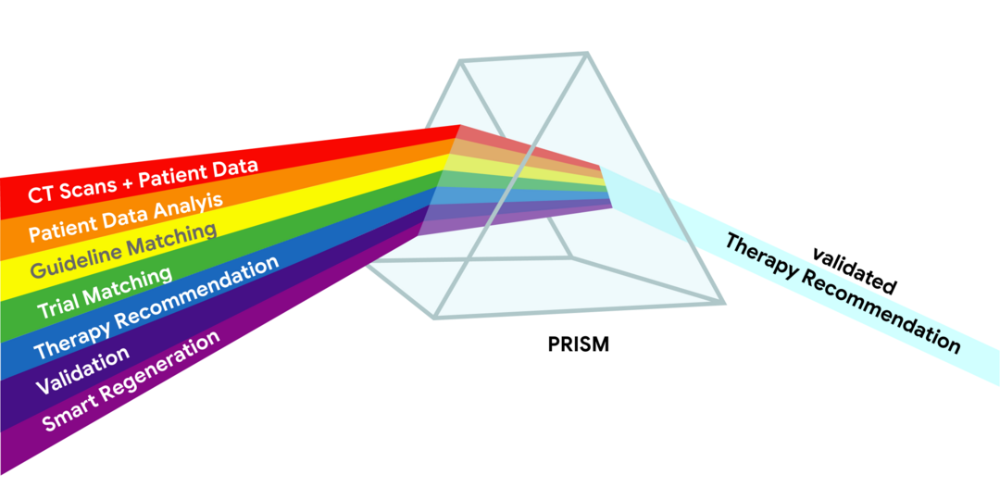
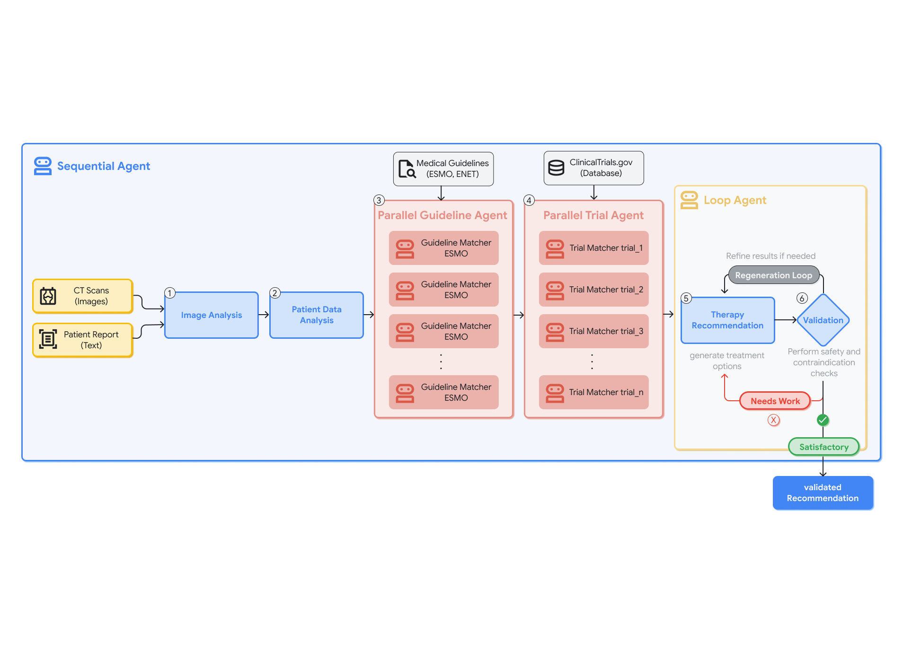
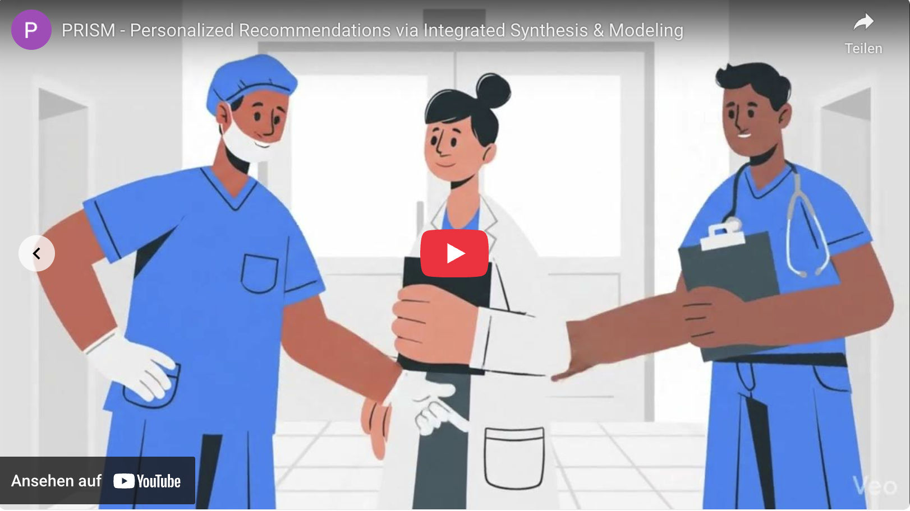

# PRISM - Personalized Recommendation via Integrated Synthesis & Modeling

A Modular LLM Workflow for Tumor Board Decision Support

## Media Gallery

- TODO: Evaluation Gradio App
- TODO: Tumorboard Gradio App

## Team

### Pia Koller

_PhD Student, University of Bern_

- Developed and lead evaluation of the initial version of the PRISM pipeline
- Implemented the Gradio interface for clinician interaction

### Dr. Christoph Clement

_Postdoctoral Researcher, University of Bern_

- Supervised initial pipeline development
- Reimplemented the system using Google ADK and vLLM for local deployment

### Prof. Robert Seifert

_Senior Physician, University Hospital Bern_

- Supervised initial pipeline development
- Defined complex Neuroendocrine Tumor (NET) clinical logic, curated specific ENETS/ESMO guideline source, and validated model recommendations

## Problem Statement

Multidisciplinary tumor boards are essential for cancer care, but preparing for them is becoming an overwhelming manual task. This is especially true for rare malignancies like Neuroendocrine Tumors (NETs). Clinicians have to dig through patient histories, cross-reference ever-changing guidelines from providers such as ENETS or ESMO , and search for clinical trials — all while ensuring treatment fits a patient’s specific comorbidities. Deep expertise in NETs is often locked away in specialized centers, leaving community oncologists with less support. While cloud-based AI could help, hospitals can't use it because of strict GDPR and data privacy laws. You simply cannot send sensitive patient health information (PHI) to an external server.
There is a critical need for a locally deployable intelligent system that can automate evidence retrieval without compromising security. PRISM fills this gap as a solution that aligns multimodal patient data with guidelines and trials locally. By reducing manual literature review time, PRISM enables clinicians to focus on final decision-making, improving delivery of personalized, evidence-based therapies while ensuring strict adherence to the latest clinical trial data. In practice, tumor board preparation for a single NET case can take a clinician 30-60 minutes of manual literature review. PRISM generates a structured, evidence-backed recommendation in under 5 minutes, allowing clinicians to focus on deliberation rather than data gathering. PRISM is not intended to replace clinician judgment. It is designed to reduce preparation burden, increase evidence transparency, and democratize rare tumor expertise.

## Overall Solution

PRISM is a locally deployable "co-pilot" for tumor boards powered by MedGemma 27B. Instead of using one long, messy prompt, PRISM breaks the reasoning process into modular stages to keep the LLM focused and accurate. We tested both MedGemma 4B and 27B on fictional NET cases. Our clinical expert found that the 27B model offered better reasoning, safety profiling, and guideline adherence. Consequently, we built the entire pipeline around the 27B version. The core design decision was task isolation. Tumor board cases require reasoning over imaging, unstructured clinical notes, full-text guidelines, and trial eligibility criteria simultaneously. Feeding all of that into a single prompt degrades output quality. So we broke the pipeline into six sequential stages, each with a narrow scope.

MedGemma handles three distinct reasoning types across the pipeline:

**Visual Reasoning**: The `CTImageAnalyzer` agent processes axial and coronal CT scans directly using MedGemma's multimodal capabilities to produce a structured radiologic summary.

**Clinical Extraction**: The `PatientDataAnalyzer` agent converts unstructured clinical notes into structured fields (e.g. tumor grade, Ki-67 index, functional status, comorbidities) that downstream agents can query reliably.

**Evidence Synthesis**: `GuidelineMatcher` and `TrialMatcher` agents take that structured patient profile and run it against full-text ENETS/ESMO guidelines and a curated set of trials. Every recommendation includes source citations.

**Therapy Recommendation & Safety Validation**: The `TherapyRecommender` synthesizes the retrieved evidence into a personalized treatment plan. Lastly, a `Validator` agent provides a final cognitive check. It runs a five-point safety review to catch contraindications or incomplete reasoning chains. If it detects issues, it autonomously forces the system to revise the recommendation before outputting the result.

By structuring the workflow around MedGemma’s strengths, PRISM demonstrates how HAI-DEF models can function as secure, workflow-integrated reasoning engines rather than generic chat interfaces.

## Technical Details

PRISM runs entirely on-premise on a server with four NVIDIA A6000 GPUs. We used Google’s Agent Development Kit (ADK) and vLLM to serve the model locally. No data leaves the hospital network.
The agentic pipeline consists of six sequential stages.

1. **CTImageAnalyzer** - Processes CT scans and outputs a structured `CTReport` covering tumor size, vascular involvement, and metastatic distribution

2. **PatientDataAnalyzer** - Extracts a validated `PatientData` object from unstructured clinical text.

3. **GuidelineMatcher** - Uses ADK's ParallelAgent to run concurrent evaluations against ENETS and ESMO guidelines. Both run at the same time against the same patient profile.

4. **TrialMatcher** - Checks eligibility against a curated subset of high-impact Phase III NET trials. The trial scope was limited for the demo to keep inference time reasonable.

5. **TherapyRecommender** - Synthesizes the upstream evidence into a multi-phase treatment proposal with embedded guideline and trial citations.

6. **Validator** - A LoopAgent that runs a five-point safety review: acute contraindications, drug–comorbidity conflicts, incomplete reasoning chains. If it finds problems, it flags them and the system revises the recommendation before exiting via ADK's `exit_loop` mechanism.

To keep the system reliable, we use Pydantic schema enforcement. This forces the agents to communicate in structured JSON, which prevents the AI from producing malformed outputs, keeping the "context window" lean and fast.
The system is observable and auditable. Langfuse integration enables trace-level monitoring of agent reasoning steps, while the Gradio interface provides clinicians with structured outputs, citation references, and safety annotations in an intuitive workflow.
PRISM is currently a functional decision support tool that can be deployed on a single GPU server. A board-certified nuclear medicine physician reviewed all pipeline outputs across three fictional NET cases, providing structured feedback on each agent's reasoning. The review confirmed that PRISM produces clinically coherent recommendations with appropriate guideline citations, while identifying areas for improvement such as more robust biomarker-therapy consistency checks and better handling of edge cases like borderline tumor grading. These findings directly informed iterative prompt refinement.

## Conclusion

This submission presents a simplified, multimodal version of PRISM built for the MedGemma Impact Challenge. A more comprehensive text-only version — featuring automated trial verification, self-correcting validation loops, and systematic evaluation by five physicians across 15 NET cases — has been submitted as an abstract to ASCO 2025, with a full manuscript currently in preparation.

## References

### CT Images

- Patient 1: Knipe H, Small bowel neuroendocrine tumor. Radiopaedia.org. [DOI: 10.53347/rID-42873](https://doi.org/10.53347/rID-42873)
- Patient 2, 3: Walker N, Mesenteric carcinoid causing acute cecal ischemia. Radiopaedia.org. [DOI: 10.53347/rID-74881](https://doi.org/10.53347/rID-74881)

### Clinical Trials

- COMPETE: [NCT03049189](https://clinicaltrials.gov/study/NCT03049189) — 177Lu-edotreotide vs Everolimus in GEP-NET
- NETTER-2: [NCT03972488](https://clinicaltrials.gov/study/NCT03972488) — Lutathera in G2/G3 GEP-NET

### Clinical Guidelines

- Grozinsky-Glasberg S et al. ENETS 2022 Guidance Paper for Carcinoid Syndrome and Carcinoid Heart Disease. J Neuroendocrinol. [DOI: 10.1111/jne.13146](https://doi.org/10.1111/jne.13146)
- Kaltsas G et al. ENETS 2023 Guidance Paper for Appendiceal Neuroendocrine Tumours. J Neuroendocrinol. [DOI: 10.1111/jne.13332](https://doi.org/10.1111/jne.13332)
- Rinke A et al. ENETS 2023 Guidance Paper for Colorectal Neuroendocrine Tumours. J Neuroendocrinol. [DOI: 10.1111/jne.13309](https://doi.org/10.1111/jne.13309)
- Sorbye H et al. ENETS 2023 Guidance Paper for Digestive Neuroendocrine Carcinoma. J Neuroendocrinol. [DOI: 10.1111/jne.13249](https://doi.org/10.1111/jne.13249)
- Hofland J et al. ENETS 2023 Guidance Paper for Functioning Pancreatic Neuroendocrine Tumour Syndromes. J Neuroendocrinol. [DOI: 10.1111/jne.13318](https://doi.org/10.1111/jne.13318)
- Panzuto F et al. ENETS 2023 Guidance Paper for Gastroduodenal Neuroendocrine Tumours G1-G3. J Neuroendocrinol. [DOI: 10.1111/jne.13306](https://doi.org/10.1111/jne.13306)
- Kos-Kudla B et al. ENETS 2023 Guidance Paper for Nonfunctioning Pancreatic Neuroendocrine Tumours. J Neuroendocrinol. [DOI: 10.1111/jne.13343](https://doi.org/10.1111/jne.13343)
- Lamarca A et al. ENETS 2024 Guidance Paper for Small Intestine Neuroendocrine Tumours. J Neuroendocrinol. [DOI: 10.1111/jne.13423](https://doi.org/10.1111/jne.13423)
- Pavel M et al. ESMO 2020 Clinical Practice Guidelines for Gastroenteropancreatic Neuroendocrine Neoplasms. Ann Oncol. [DOI: 10.1016/j.annonc.2020.03.304](https://doi.org/10.1016/j.annonc.2020.03.304)

## Links

- TODO: GitHub repository
- TODO: Evaluation Gradio App
- TODO: Tumorboard Gradio App
